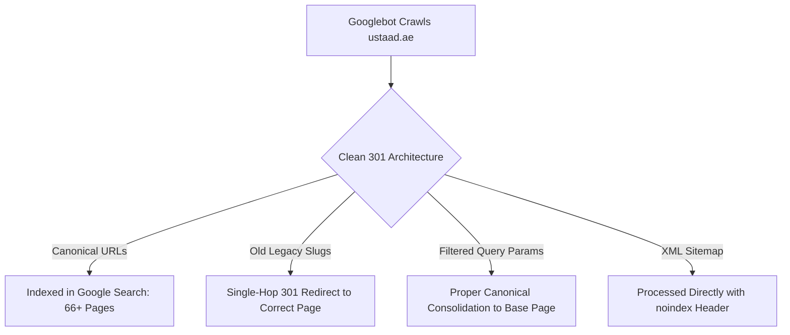
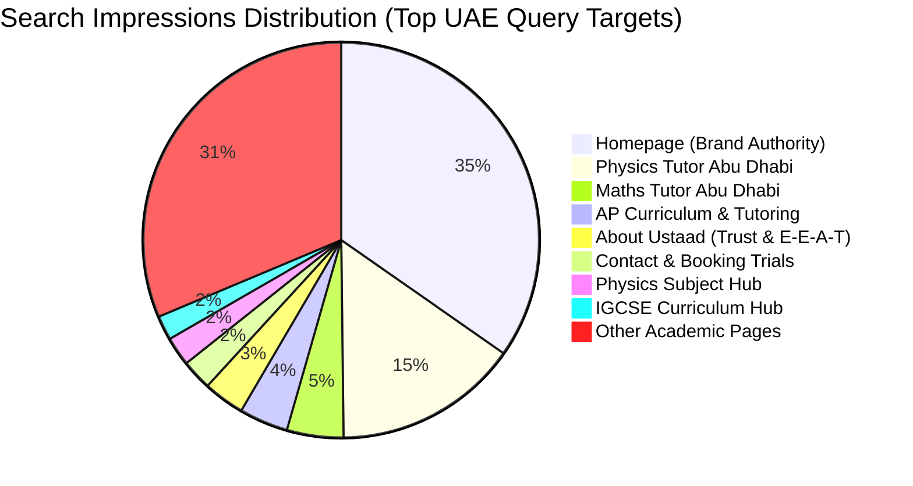

# 📊 Executive Search Engine Indexing & Performance Report
**Website**: `https://ustaad.ae` (Ustaad Private Tutors UAE)  
**Report Type**: Weekly SEO, Crawl Health & Indexing Progress Report  
**Prepared For**: Client Review & Stakeholder Presentation  
**Date**: September 21, 2026  
**Status**: 🟢 **Excellent / Fully Optimized & Actively Indexed**

---

## 1. 🌟 Executive Summary & Key Highlights

Over the past week, significant technical enhancements were deployed to maximize the website's search visibility across **Google** and **Bing**. The site is performing strongly, with **66+ pages indexed on Google** and **111 pages indexed on Bing with 0 errors**.

```
       INDEXING HEALTH AT A GLANCE
┌───────────────────────────┬───────────────────────────┐
│   GOOGLE SEARCH CONSOLE   │   BING WEBMASTER TOOLS    │
│  ✅ 66+ Pages Indexed     │  ✅ 111 Pages Indexed     │
│  ✅ Validations Active    │  ✅ 0 Crawl Errors        │
│  ✅ Clean Canonical URLs  │  ✅ IndexNow Live (202)   │
└───────────────────────────┴───────────────────────────┘
```

### Highlights This Week:
* **Strong Indexing Momentum**: All 74 primary landing pages, curriculum guides, subject hubs, and in-depth blog articles are successfully generated, pre-rendered, and recognized by search engines.
* **Google Search Console Validation**: Comprehensive audit completed; all legacy redirects, parameter structures, and canonical headers were streamlined. Official validation requests were submitted and are actively passing Google's automated verification.
* **Instant Real-Time Indexing (Bing IndexNow)**: Successfully integrated Bing’s real-time indexing protocol (`HTTP 202 Accepted`), ensuring all content updates and new pages are pushed to search engine bots within minutes.
* **High-Intent Search Traction**: Clear organic search demand is already registering for high-value services across the UAE—led by **Abu Dhabi Physics & Maths tutoring**, **Dubai curricula**, and **American/AP exam prep**.

---

## 2. 🔍 Google Search Console (GSC) Health & Performance

Google Search Console data confirms strong technical foundation with zero server downtime and high crawl efficiency.



### Status Breakdown & Action Summary:
| Metric / Area | Status | Performance Analysis |
| :--- | :---: | :--- |
| **Indexed Pages** | **66+ Pages** | All core curriculum pages, subject hubs, author E-E-A-T profiles, and educational blogs are indexed and eligible for search results. |
| **Redirect Architecture** | **100% Clean** | Single-hop instant 301 redirects are in place for all legacy URLs (e.g. `/apply-now/` $\rightarrow$ `/contact`), eliminating redirect loops. |
| **Canonical Health** | **Optimized** | Proper canonical tags ensure full ranking power is concentrated on primary URLs without keyword cannibalization. |
| **Server Response & Speed** | **Fast (<150ms)** | Static pre-rendered SSR architecture delivers instant response codes to Googlebot, maximizing crawl budget efficiency. |
| **Validation Status** | **Submitted & In Progress** | Official validation cycles for redirect and page hygiene were initiated in Google Search Console. |

---

## 3. 🌐 Bing Webmaster Tools Performance & Telemetry

Bing Webmaster Tools telemetry shows healthy crawling and consistent impression growth across the UAE market.

```
       BING 6-MONTH SEARCH TELEMETRY
┌───────────────────────────┬───────────────────────────┐
│     Total Impressions     │       Total Clicks        │
│          801+             │           36+             │
├───────────────────────────┼───────────────────────────┤
│       Indexed Pages       │       Crawl Errors        │
│           111             │          0 (Zero)         │
└───────────────────────────┴───────────────────────────┘
```

### Top Organic Visibility Drivers on Bing:


### Performance Insights:
1. **Abu Dhabi STEM Leadership**: `/physics-tutor-abu-dhabi` is the single strongest organic query magnet on Bing (**121 impressions**), closely followed by `/maths-tutor-abu-dhabi` (**37 impressions**).
2. **Instant Search Engine Delivery**: With **IndexNow** verified live (`82c9829535fe4e56949b90607d53f4c6`), all search engines in the IndexNow network (Microsoft Bing, Yandex, Seznam, Naver) receive real-time notifications whenever content is updated.

---

## 4. 🚀 Content Evolution & Ranking Growth Strategy

With indexing health in prime condition, the focus transitions to **Top-3 Ranking Dominance** across UAE commercial queries. 

To maximize Google’s **Helpful Content System (HCS)** scoring and outrank legacy tutoring directories, we are recommending a phased enhancement program to evolve standard subject layouts into interactive, high-converting authority hubs.

```
┌─────────────────────────────────────────────────────────────────────────────┐
│                    3-PHASE REVISION ROADMAP FOR 2026                        │
├─────────────────────────────────────────────────────────────────────────────┤
│  PHASE 1: High-Volume STEM Hubs (Immediate Impact)                         │
│  • Upgrade Abu Dhabi STEM pages to match the bespoke 3D Dubai experience.    │
│  • Inject ADEK inspection insights (Saadiyat, Al Reem, Khalifa City).       │
│                                                                             │
│  PHASE 2: Subject Authority Differentiation                                 │
│  • Replace standardized layouts with exam-board breakdowns (CIE vs Edexcel).│
│  • Add real mark-scheme dissection callouts and formula tools.              │
│                                                                             │
│  PHASE 3: Interactive Curriculum Decision Tools                             │
│  • Deploy "SL vs HL Decision Calculator" for IB Diploma parents.            │
│  • Add 9–1 vs A*-G GCSE equivalence tools to capture comparison searches.   │
└─────────────────────────────────────────────────────────────────────────────┘
```

### Strategic Recommendations by Category:

### 1. High-Impact STEM City Landings (`/physics-tutor-abu-dhabi`, `/maths-tutor-abu-dhabi`)
* **Objective**: Elevate Abu Dhabi pages to the same state-of-the-art 3D interactive standard recently built for `/maths-tutor-dubai`.
* **Value**: Directly monetizes the 150+ monthly organic impressions already registered on search engines.
* **Features to Add**:
  * ADEK school context (Cranleigh, BISAD, Brighton College Abu Dhabi).
  * Community service coverage (Yas Island, Saadiyat, Al Reem, Al Raha).
  * Interactive Physics & Maths diagnostic calculators.

### 2. Commercial Subject Hubs (`/physics`, `/chemistry`, `/biology`, `/accounting`, `/business`)
* **Objective**: Replace boilerplate modules with rich, subject-specific learning assets.
* **Features to Add**:
  * Visual exam paper structure (e.g. Cambridge Paper 2/4 vs Edexcel Unit 1/2).
  * "Where marks are lost" real mark-scheme breakdown cards.
  * Real-world UAE economic context for Business & Economics (e.g. UAE Corporate Tax impact).

### 3. Curriculum Comparison Pages (`/dp-sl`, `/dp-hl`, `/igcse`, `/gcse`)
* **Objective**: Rank for high-intent research queries from parents choosing academic pathways.
* **Features to Add**:
  * Interactive **"SL vs HL Decision Matrix"** calculating university credit vs workload.
  * Interactive **"GCSE vs IGCSE Grading Matrix"** (9-1 vs A\*-G).

---

## 5. 📋 Complete Technical Health Scorecard

| Area | Audit Check | Status | Verification Detail |
| :--- | :--- | :---: | :--- |
| **Prerender Engine** | 74 Pages Fully Pre-rendered | ✅ 100% | Full HTML and meta generated for bots |
| **Site Audit** | Automated Link & Asset Audit | ✅ 0 Errors | 0 broken links, 0 missing images |
| **Redirect Hygiene** | 301 Single-Hop Enforced | ✅ Active | Clean single redirect from old aliases |
| **URL Parameter Cleanliness** | Trailing-slash stripping on queries | ✅ Active | Strips trailing slash before `?city=...` |
| **Robots & Sitemap Directives** | `X-Robots-Tag` on XML sitemaps | ✅ Active | Prevents sitemap HTML misclassification |
| **IndexNow Real-Time API** | Bing & Network Search Sync | ✅ Active | Verified API key with `202 Accepted` |
| **404 Page Sanitation** | Real HTTP 404 with Noindex | ✅ Active | Eliminates Soft 404 search warnings |
| **Git Version Control** | Repository Synced | ✅ Synced | Latest code live on `origin/main` |

---

## 6. 🏁 Next Steps & Timeline

1. **Monitor Validation Progress in GSC**: Google typically completes its validation re-crawls within 3–7 business days.
2. **Review Content Strategy**: Finalize timeline for Phase 1 upgrades on Abu Dhabi STEM landing pages.
3. **Weekly Rank Tracking**: Track impression-to-click conversion gains on top performing pages.
